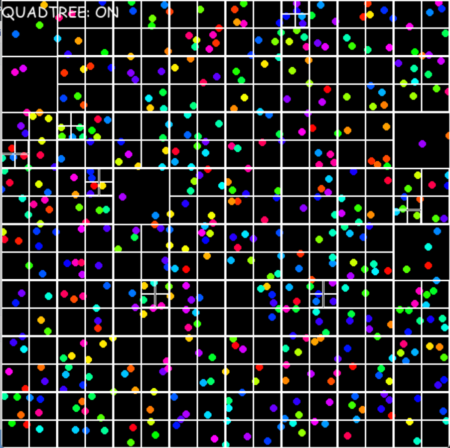

# Quad Tree Collision Detection
Inspired by https://www.youtube.com/watch?v=OJxEcs0w_kE

A DIY implementation of the code above in python with colorful balls and more realistic collision physics

## Dependencies
- pygame 2.1.2

## Screenshot

